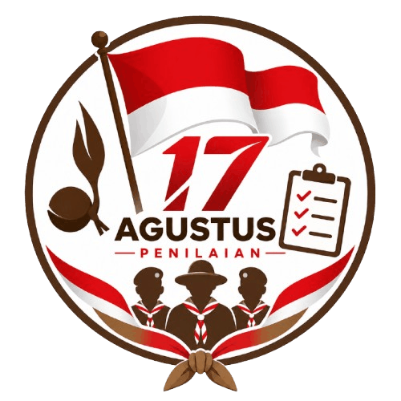

<p align="center">
  
</p>

<h1 align="center">Penilaian Lomba</h1>

<p align="center">
  Aplikasi web mobile-friendly untuk mengelola penilaian lomba antar sekolah —<br>
  dari pendaftaran peserta, penugasan juri, penilaian di lapangan, hingga papan peringkat live dan rekap nilai.
</p>

<p align="center">
  
  
  
  
  
</p>

<p align="center"><em>Dibangun untuk <strong>Kwarcab Kota Padangsidimpuan</strong></em></p>

---

## ✨ Fitur Utama

Ringkasan modul yang tersedia di aplikasi ini beserta fungsinya masing-masing.

| Modul | Deskripsi |
|---|---|
| 📊 **Dashboard** | Ringkasan aktivitas: jumlah peserta per jenjang, tren penilaian, progres tiap lomba & juri |
| 🏆 **Lomba & Kriteria** | CRUD lomba, kriteria per jenjang (SD/SMP/SMA), penugasan juri per kriteria per jenjang |
| 👥 **Peserta Lomba** | Slot pendaftaran massal tanpa perlu identitas sekolah di awal — disinkronkan belakangan |
| 🧑‍⚖️ **Juri** | Manajemen akun juri, riwayat penugasan & progres penilaian |
| ✍️ **Penilaian** | Alur kerja juri di lapangan: cari peserta, isi nilai dengan stepper +/-, catatan bersuara (speech-to-text realtime), konfirmasi sebelum simpan |
| 📡 **Live Rank** | Papan peringkat publik, live update tanpa reload, badge nilai sementara jika penilaian belum lengkap |
| 📄 **Rekap** | Tabel rekap nilai lengkap dengan catatan juri, cetak & unduh PDF |

## 🧰 Tech Stack

Kumpulan teknologi yang dipakai untuk membangun aplikasi ini.

- **[Laravel 13](https://laravel.com)** — framework backend
- **[Livewire 4](https://livewire.laravel.com)** — komponen full-stack reaktif, class-based & modular per modul
- **[Tailwind CSS](https://tailwindcss.com)** — desain mobile-first dengan mode gelap
- **MySQL / MariaDB** — database
- **[barryvdh/laravel-dompdf](https://github.com/barryvdh/laravel-dompdf)** — ekspor Rekap ke PDF
- **Web Speech API** (via Alpine.js) — catatan penilaian dengan suara, realtime
- **`wire:poll`** — pembaruan Live Rank tanpa websocket

## 🚀 Memulai

Langkah-langkah menyiapkan aplikasi ini di lingkungan lokal, dari instalasi sampai menjalankan test.

### Instalasi

Memasang dependency PHP & JavaScript, lalu menyiapkan file environment.

```bash
composer install
npm install

cp .env.example .env
php artisan key:generate
```

Sesuaikan koneksi database pada `.env`, lalu jalankan migrasi & seeder:

```bash
php artisan migrate --seed
```

### Menjalankan Aplikasi

Menyalakan server Laravel dan proses build asset (Vite) secara bersamaan untuk pengembangan.

```bash
php artisan serve
npm run dev
```

### Menjalankan Test

Menjalankan seluruh test suite untuk memastikan aplikasi berjalan sesuai harapan.

```bash
php artisan test
```

## 🗂️ Struktur Peran

Hak akses tiap peran pengguna terhadap modul-modul di atas.

| Peran | Akses |
|---|---|
| **Admin** | Dashboard, Lomba & Kriteria, Peserta, Juri, Rekap |
| **Juri** | Dashboard, Penilaian |
| **Publik** | Live Rank (tanpa login) |

---

## 👤 Developer

Aplikasi ini dikembangkan dan dirawat oleh:

<p align="center">
  <strong>Yoviansyah Rizki Pratama</strong><br>
  📱 WA: 081222778197 &nbsp;·&nbsp; ✉️ yoviansyahrizkypratama@gmail.com
</p>

### ☕ Dukungan

Jika aplikasi ini bermanfaat dan ingin mendukung pengembangannya lebih lanjut, silakan hubungi developer melalui kontak di atas untuk informasi donasi.

---

<p align="center"><sub>Built with 🤖 Claude.ai</sub></p>
